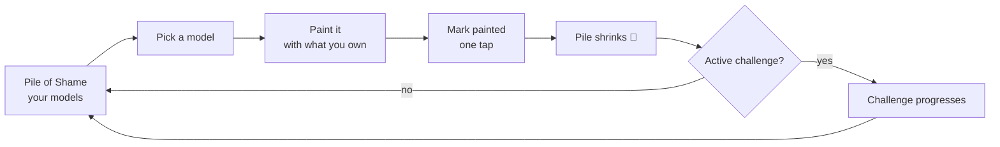
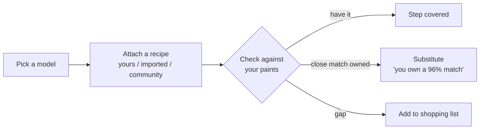

# GPoS — Core Loop Product Spec

**Companion doc to** `Paint_Tracker_6_Month_Roadmap.md`. The roadmap says _what ships when_; this says _how the loop works_.

> **Reframed (v2).** The launch core is the **pile loop** — no color math required to close it. The substitution/recipe engine described in §3-6 is a **Phase-4 depth layer**, not a Phase-1 gating dependency. The app is fully usable without an account (local browser storage); account creation is the "save & sync" step.

---

## 1. The loop

Everything in the product serves one loop. If a feature isn't a node on it or making a node faster, it's out of scope for the core.

```
Pile of Shame → Pick a model → (optionally) note paints used → Paint it → Mark painted → Pile shrinks 🎉 → Challenge progresses → Loop
```

The emotional payoffs are: the pile shrinking and the challenge ticking forward. The intelligence layer (paint substitution, recipe translation) comes later and makes the loop smarter — but the loop closes without it.

**The launch core loop:**



**The Phase-4 depth layer (added when the loop is solid):**



---

## 2. Core entities (data model)

All user-domain tables are already migrated. Names and columns are exact — see migrations.

**MiniatureItem** — the pile entry. `id`, `user_id`, `display_name`, `game`, `faction`, `unit_size` (1 for single, N for batch), `state` (`unbuilt / built / primed / in_progress / painted`), `painted_at` (set by the app on transition into `painted`, not a trigger), `point_value`. Kit catalog FK (`kit_id`) nullable.

**UserPaint** — a paint in a user's collection. `catalog_paint_id` (nullable) or custom (`custom_name`, `custom_hex`). `state`: owned / wishlist / running_low.

**Profile** — one row per user, auto-created on signup. `display_name`, `deletion_requested_at` (DSGVO stub; hard-delete is a later admin/cron job).

**Challenge** — a personal goal. `type` (preset or custom), `title`, `target` (count or date), `deadline`, `status` (active / completed / abandoned), `visibility` (private / public — community ready, UI personal-only at launch).

**ChallengeProgress** — snapshots as the pile changes; drives the challenge progress display.

**Recipe** — Phase 4. An ordered list of steps; each step has a `role` and a `target_paint_id`. Brand-agnostic by construction so any recipe can be re-expressed in any brand by running each step through the substitution engine.

**RecipeApplication** — Phase 4. A recipe attached to a model; caches per-step resolution (have_exact / have_substitute / gap).

**PaintCatalogEntry** — the shared, seeded catalog (`paints` table). LAB columns exist and are used by the Phase-4 substitution engine. Not a dependency for Phase 1-3.

---

## 3. Local-first storage (Phase 1 foundation)

The app opens without requiring login. Data lives in browser localStorage under a versioned key. On account creation, local rows are pushed into Supabase under the new `user_id` (idempotent — a migration flag prevents double-insert on refresh).

**One `PileStore` interface, two backends:**

- `localPileStore` — localStorage, versioned JSON, corrupt-data fallback to `[]`, SSR-safe.
- `supabasePileStore` — RLS browser client (`lib/supabase/client.ts`, never `adminClient`). `user_id` set explicitly on every insert so the RLS `with check` passes.
- `usePile()` hook picks the backend from session state.

This is the architecture's key decision: pile UI is **client components** driving the store, not server actions (anonymous users have no session for RLS to key off). The admin area stays server-action-first — unchanged.

---

## 4. Challenges (Phase 2 — center of gravity)

**Preset templates:**

- _Weekend Warrior_ — paint 1 model before the weekend ends.
- _Month of Shame_ — reduce pile by N models this month.
- _Unit Finisher_ — complete every model in a named unit (game + faction tag).
- _Pledge to Paint_ — commit to a specific model + deadline.

Progress is auto-derived from pile state changes — no manual input required. A challenge "completes" when its target condition is met; a completion moment (badge, animation) is the dopamine payoff. Streaks ("painted X sessions in a row") are a secondary mechanic.

The schema is community-ready (`visibility`, nullable `user_id` for admin-created challenges) but the UI ships personal-only.

---

## 5. The substitution engine (Phase 4 — the depth layer)

> **This section describes a future depth feature. It is not required to close the launch core loop.**

**Color space.** Compare in CIE LAB, not hex/RGB. Store `lab_l/a/b` per paint at seed time (sRGB → XYZ → LAB, D65).

**Distance metric.** CIEDE2000 (ΔE₀₀). Use `culori` — don't hand-roll it.

**Role-aware tolerance.** A recipe step's role sets how strict the match must be. Edge highlights are strict (ΔE < 1.5); basecoats are forgiving (ΔE < 5.0). A "how picky are you?" control (relaxed / balanced / strict) scales all ceilings.

**Verdict per step:** Have exact / Close match owned ("you own X — a 96% match") / Gap (routes to shopping list).

**Honesty rule.** If the closest owned paint is borderline, say so. A wrong "96%" that looks off on the model destroys trust in the whole engine. Never over-claim.

---

## 6. "What can I paint right now?" (Phase 4)

Given owned paints + the pile + favorited recipes, surface a model + recipe completable today with zero purchases. Requires the substitution engine (Phase 4). The Phase-1 version of this feature is simpler: "here's a model from your pile you could start on" based purely on pile state, no paint check.

---

## 7. Smart consolidated shopping list (Phase 4)

Across all planned recipe applications: collect gaps, apply cross-recipe substitution (one paint can cover two recipes' needs), dedup, present the genuine minimum to buy with affiliate routing. The counterintuitive promise — the list is shorter than the naive sum — is the trust-builder.

---

## 8. Pile of shame: states and payoff

**States:** unbuilt → built → primed → in_progress → painted. Linear but skippable.

**Batch reality:** `unit_size > 1` lets a MiniatureItem represent a unit of N identical minis. The quick-count onboarding uses skeletal items (one per state × count entered) that are named and enriched later.

**The payoff surfaces (Phase 1):**

- Painted-vs-unpainted ratio grouped by state (the "pile shrinks" view).
- Challenges dashboard showing active pledges and progress.

**The payoff surfaces (Phase 2+):**

- "Painted this month" count and streak.
- Painted-points (sum of `point_value` for painted models — Warhammer players track this for events).
- A view worth screenshotting = organic growth.

---

## 9. Onboarding — the data-capture flows

One rule: **value before completeness**. They get a satisfying pile view in under 2 minutes and enrich over weeks, never hitting a wall of data entry. No login required.

**Quick-count (Phase 1):** one stepper per state — "roughly how many unbuilt / built / primed / started?" Instantly visualize the pile. No naming required; refine into individual models later.

**Faction templates (Phase 2):** "You play Death Guard — tap the units you own" from a seeded unit list.

**Box-barcode scan (Phase 4):** scan the box → resolves to the kit.

**Paint range (Phase 3):**

- Visual brand grid: tap pots from a swatch grid of your brand's range.
- Add-by-set: tap the boxed sets you bought → every contained paint added at once.
- Pot-barcode scan (Phase 4).

---

## 10. Critical-path dependencies (reframed)

**Phase 1 (the true critical path):**

1. Local-first storage abstraction (pile works without login).
2. Pile state machine + quick-count onboarding.
3. Generalized magic-link auth + migrate-on-signup.
4. Challenges (personal, preset first).

**Phase 4 (color depth, unlocked after the loop is solid):**

1. Paint catalog with verified LAB values — gates substitution.
2. Substitution engine (`culori`, CIEDE2000).
3. Recipe model — gates the recipe library.

---

## 11. Explicitly NOT in the core loop (deferred)

- **Substitution engine / `culori` / LAB** — Phase 4.
- **Recipe authoring** — Phase 4 (Phase 3 ships "which paints did you use?" as a simple list).
- **YouTube tutorial pipeline** — Month 8.
- **AI photo shelf-scan / photo-of-mini → recipe** — Year 2.
- **Social graph** (follow, like, comment) — post-launch.
- **Premium tier / paywalled features** — Year 2 at earliest.
- **Live retailer stock/price feeds** — Month 10.
- **Push notifications, iOS native** — later.
