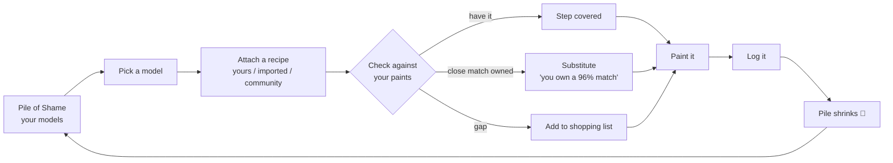

# GPoS — Core Loop Product Spec

**Companion doc to** `Paint_Tracker_6_Month_Roadmap.md`. The roadmap says *what ships when*; this says *how the loop works*. Scope: the months 1-4 core. Deliberately ignores launch logistics, monetization, and marketing.

---

## 1. The loop

Everything in the product serves one loop. If a feature isn't a node on it or making a node faster, it's out of scope for the core.

The emotional payoff is the last edge: the pile shrinks. The intelligence that makes it feel magic is node D — substitution against what you already own.

---

## 2. Core entities (data model)

Names are indicative; align to the existing v0.1 schema where it already exists (the `paints` and `conversions` tables are built).

**PaintCatalogEntry** — the seeded, shared catalog (already exists as `paints`).
`id (slug)`, `brand`, `range`, `name`, `sku_code`, `barcode`, `hex`, `lab_l`, `lab_a`, `lab_b`, `size_ml`, `type` (base/layer/shade/contrast/technical/primer/...), `status` (current/discontinued), `discontinued_date`, `version`.
*LAB is computed from hex at seed time and stored — never computed at query time.*

**UserPaint** — a catalog entry (or custom paint) in a user's collection.
`id`, `user_id`, `catalog_paint_id` (nullable for custom), `custom_name`, `custom_brand`, `custom_hex`, `state` (owned / wishlist / running_low), `added_at`. Custom paints get derived LAB from `custom_hex`.

**MiniatureItem** — an entry in the pile of shame.
`id`, `user_id`, `kit_id` (nullable, links to seeded kit catalog when known), `display_name`, `game`, `faction`, `unit_size` (1 for single, N for a batch unit), `state` (unbuilt / built / primed / in_progress / painted), `created_at`, `painted_at`, `point_value` (optional, for painted-points).

**Recipe** — a reusable, brand-agnostic scheme.
`id`, `author_user_id`, `title`, `description`, `visibility` (private/public), `source_type` (original / imported / tutorial), `source_url`, `created_at`. Has many `RecipeStep`.

**RecipeStep** — one ordered step.
`recipe_id`, `order`, `role` (basecoat / shade / wash / layer / highlight / edge / drybrush / contrast / glaze / technical / other), `target_paint_id` (catalog ref), `target_hex` (denormalized for resilience if a paint is discontinued), `technique_note`, `area_note` (e.g. "armour plates").

**RecipeApplication** — a recipe attached to a model/unit (the join that closes the loop).
`id`, `user_id`, `miniature_item_id`, `recipe_id`, `status` (planned / in_progress / done), `per_step_resolution` (cached: for each step — have_exact / have_substitute(user_paint_id, ΔE) / gap), `applied_at`.

**Substitution result** (computed, not stored long-term) — for a given target paint + a user's inventory: ranked list of owned paints by ΔE, each tagged with a role-aware verdict.

**Conversion** — the shared cross-brand mapping (already exists). Powers the public funnel *and* seeds substitution defaults, but substitution against a personal inventory is the live, per-user computation.

---

## 3. The substitution engine (node D — the magic)

**Problem it solves:** "This recipe calls for Citadel Mephiston Red. Do I own something close enough that I don't need to buy it?"

**Color space.** Compare in CIE LAB, not hex/RGB. RGB distance does not match perceived difference; LAB does. Store `lab_l/a/b` per paint at seed time (sRGB → XYZ → LAB, D65).

**Distance metric.** CIEDE2000 (ΔE₀₀). It's the current perceptual standard and handles the blue-region and lightness quirks that ΔE76 gets wrong. Use a library (`culori`); don't hand-roll it.

**Rough interpretation of ΔE₀₀** (calibrate against real swatches during seeding):
- `< 1.0` — imperceptible difference
- `1-2` — perceptible only on close inspection
- `2-3.5` — perceptible; fine for most basecoats
- `3.5-5` — noticeable; acceptable for undercoats/areas that get shaded over
- `> 5` — clearly different; only acceptable as a deliberate alternative

**Role-aware tolerance — the key nuance.** A step's role sets how strict the match must be. A basecoat that gets washed and highlighted over tolerates far more deviation than a final edge highlight, which is the color the eye lands on.

| Role | Acceptable ΔE₀₀ ceiling (default) | Rationale |
| --- | --- | --- |
| basecoat / undercoat | ~5.0 | gets covered/shaded; forgiving |
| layer | ~3.5 | visible but blended |
| shade / wash | ~4.0 | tints, not exact; forgiving |
| contrast | ~3.0 | one-coat color *is* the result |
| highlight | ~2.5 | eye-catching |
| edge highlight | ~1.5 | the sharpest visual line; strict |
| drybrush | ~3.5 | texture-led, forgiving |
| glaze | ~4.0 | translucent, forgiving |

Expose a single "how picky are you?" control (relaxed / balanced / strict) that scales all ceilings by a factor, so a perfectionist and a tabletop-standard painter both get sensible answers. Default: balanced.

**Verdict per step:**
- **Have exact** — the target paint itself is in the user's inventory.
- **Close match owned** — an owned paint is within the role's ceiling. Show "you own *X* — a 96% match" where the percent is a friendly transform of ΔE (e.g. `max(0, 100 − k·ΔE)`), but also show the raw ΔE on tap for the curious. Never over-claim.
- **Gap** — no owned paint within ceiling. Offer the closest owned paint as "closest you have (not ideal)" *and* route the real target to the shopping list.

**Honesty rule.** If the closest owned paint is borderline, say so. A wrong "96%" that looks off on the model destroys trust in the whole engine. Round conservatively; let community votes and confidence refine seed data.

**Worked example.** Recipe step: *edge highlight, Citadel Fire Dragon Bright*. User owns Vallejo Game Color Hot Orange (ΔE₀₀ 1.3) and Army Painter Lava Orange (ΔE₀₀ 2.9). Edge-highlight ceiling is 1.5 → Hot Orange passes ("you own a close match"), Lava Orange fails the ceiling but is shown as "closest you have" with a caution. The Citadel paint goes on the shopping list only if the user rejects the substitute.

---

## 4. Recipe model & the GW→your-paints translation

**Brand-agnostic by construction.** A recipe is steps with *roles* and *target paints*. Because each target paint has LAB, any recipe can be re-expressed in any brand by running each step through the substitution engine — this is the "paste a Citadel recipe, get it in Vallejo" feature, which is just substitution run against a *brand* instead of an inventory.

**Two translation modes:**
- **Against a brand:** "show this recipe in Vallejo" → for each step, nearest Vallejo paint by ΔE (+ confidence).
- **Against your inventory:** "show this recipe in what I own" → the loop's node D.

**Authoring must tolerate mess.** Roles are *optional but encouraged*. A freeform "I used these paints, roughly in this order" recipe must save, or painters won't enter anything. Structure can be added later (progressive enrichment, same philosophy as onboarding).

**Resilience to discontinuation.** Store `target_hex` denormalized on each step so a recipe still renders and still substitutes even if the referenced paint is later discontinued.

---

## 5. "What can I paint right now?" (the synthesis feature)

Given a user's owned paints + their pile, surface a model + recipe completable today with zero purchases.

Algorithm sketch:
1. Candidate recipes = recipes the user has saved/favorited + public recipes matching their pile's factions/schemes.
2. For each candidate, run node D against owned paints at the user's pickiness setting.
3. A recipe is "fully paintable now" if every step resolves to *have exact* or *close match owned*.
4. Rank fully-paintable recipes by (a) how many pile models they fit, (b) average match quality, (c) recency/popularity.
5. Surface the top one on the home screen with a one-tap "start this." Always answer the question with at least the *closest* option if nothing is fully paintable ("you're one paint away from…").

This is the home screen's reason to exist and the single most delightful payoff of having all three data types (pile + paints + recipes) in one place.

---

## 6. Smart consolidated shopping list

Across **all** of a user's planned RecipeApplications:
1. Collect every step that resolves to a *gap*.
2. Apply substitution *within the shopping list itself*: if two different planned recipes each need a slightly different red and one paint covers both within tolerance, recommend the one paint, not two.
3. Dedup by catalog paint.
4. Present the genuine minimum to buy, grouped by retailer, with affiliate routing and transparent disclosure.

The counterintuitive promise — *the list is usually shorter than the naive sum* — is the trust-builder. Helping people buy less is the brand.

---

## 7. Pile of shame: states, progress, payoff

**States:** unbuilt → built → primed → in_progress → painted. Linear but skippable (you can jump straight to painted when logging a backlog).

**Batch reality:** a MiniatureItem can represent a unit of N identical minis. Progress can be partial ("6 of 10 painted") so batch painting — the norm — is first-class.

**The payoff surfaces (month 4):**
- Painted-vs-unpainted ratio, as a literally shrinking pile visual.
- "Painted this month" count and streak.
- Painted-points (sum of `point_value` for painted models) — Warhammer players track this competitively for events.
- A view worth screenshotting and sharing = organic growth.

---

## 8. Onboarding — the data-capture flows

Detailed in the roadmap's month-2 section; the data-model requirements:

- **Quick-count** writes N skeletal MiniatureItems per state (or one item with a count), nameable later. Zero friction is the point.
- **Faction templates** require a seeded kit/unit catalog keyed by game + faction. Start with the most-played factions of the most-played systems; expand via community.
- **Add-by-set** for paints requires a seeded "boxed set → contained paints" mapping. High-leverage: one tap can add 20+ paints.
- **Visual brand grid** requires swatch rendering from stored hex — already available from the catalog.
- **Barcode** (month 4) requires `barcode` populated on catalog entries and box SKUs on kits; the unknown-barcode capture loop fills gaps via community.

Rule for all flows: **never make them type what they can tap**, and **value before completeness** — they get a working loop in under 60 seconds and enrich over weeks.

---

## 9. Critical-path dependencies

1. **Paint catalog with verified LAB** — gates substitution, recipes, conversion, visual grid. Everything waits on this. (Largely built; finish and verify color values.)
2. **Substitution engine** — gates the loop, "what can I paint now," shopping list, recipe translation. Build once, reuse everywhere.
3. **Recipe model** — gates the loop and the library.
4. **Pile model + onboarding** — gates adoption.

Build order mirrors the roadmap: catalog → auth → inventory → pile → recipe → substitution → close the loop → onboarding → community/shareable surfaces.

---

## 10. Explicitly NOT in the core loop (deferred)

Kept out so the loop stays sharp:
- **YouTube tutorial pipeline** — month 8. (timestamp/recipe extraction)
- **AI photo shelf-scan** and **photo-of-mini → recipe** — year-two experiments.
- **Social graph** (follow, like, comment) — post-launch.
- **Premium tier / paywalled features** — year two at earliest; loop is free.
- **Live retailer stock/price feeds** — month 10.
- **Push notifications**, **iOS native** — later.

If a proposed feature isn't on the loop in §1, it goes on this list — not into the core.
